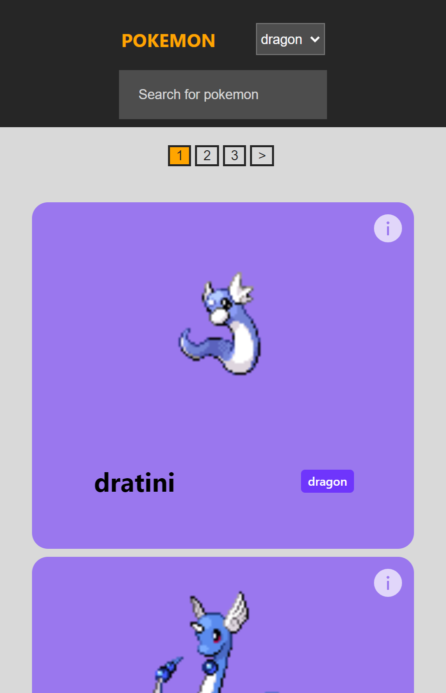

# Pokedex Project

## Introduction
Thank you for having a look on my project, I hope you enjoy it!

### Hello, thank you for taking a look on my project, it is a pokedex webpage with the idea of consulting the data from the [PokéAPI](https://pokeapi.co/) and using the pokemon info avaliable, you can check it out by the [link](https://pokedex-delta-dun.vercel.app/)

### The project has been made with React and SASS, having the best practices looking for perfomrmace, good styling and responsive design. 

### It was possible to implemment the following features: 

- Show all pokemon  
- Display general info and evolutions
- Organize the aplication using pagination  
- Filter pokemon by type and search them by name
- Add a Loading screen 

### Mobile screen

## Techs I've used:
 

  
 

 

### Developer: Cléber Severo 
 
 

 